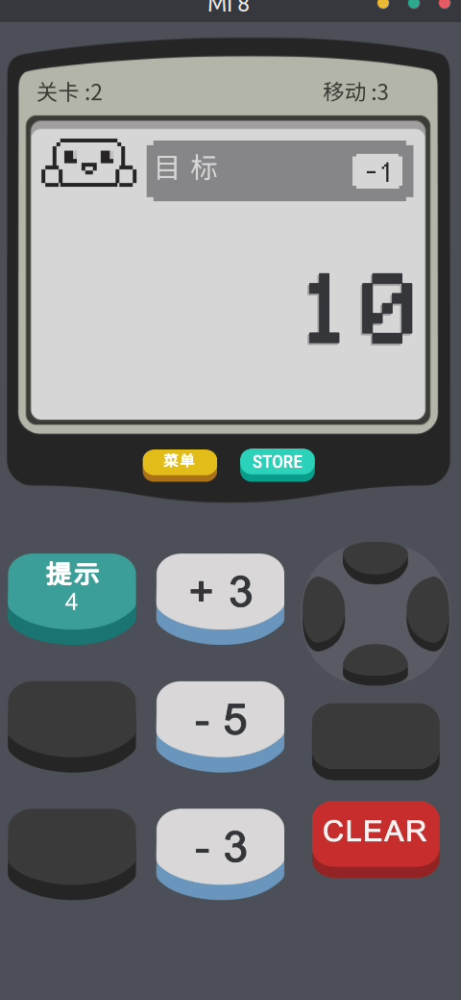
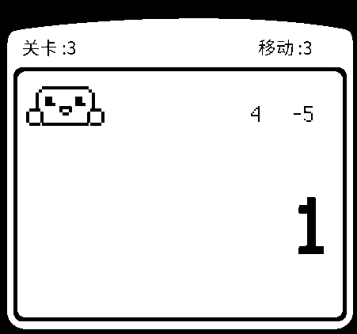
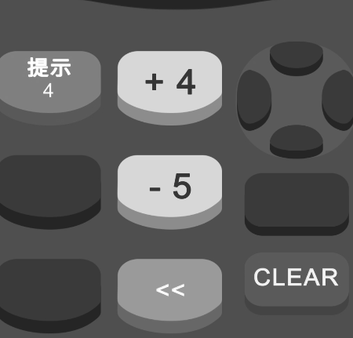

# Calculator 2 : The Game 求解程序


### 思路

游戏过关方式很简单，在限定的步骤内通过运算求得答案，直接暴力求解即可。

不过为了免去输入，将通过Tesseract识别图片内容，自动求解


## 步骤

用Scrcpy连接手机，获取屏幕内容




### 方法：

```bash
#  截图（保存到SDCard）
adb shell /system/bin/screencap -p /sdcard/screenshot.png

# 从SD卡导出到电脑，注意：电脑路径必须存在
adb pull /sdcard/screenshot.png  ./  #（保存到电脑当前路径）

#如果你想删除手机上的图片，那么你可以使用这个命令来删除
adb shell rm /sdcard/screenshot.png
```


用PIL处理图片，经过测试，上半部分二值化比较好（识别），下半部分灰度化比较好

  

根据获取的信息求解步骤

