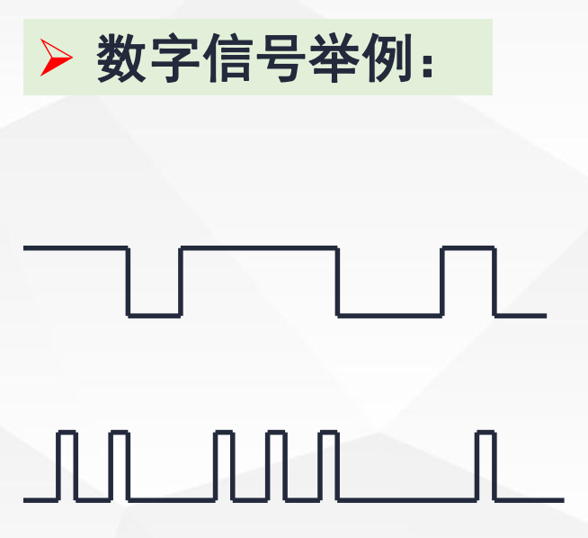
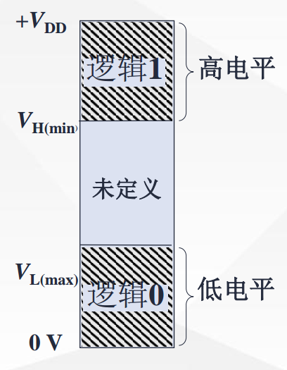
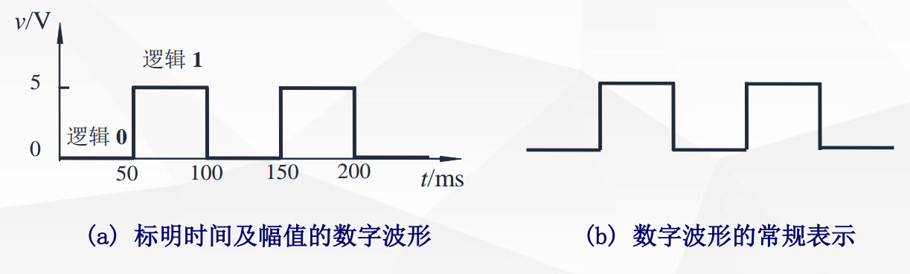
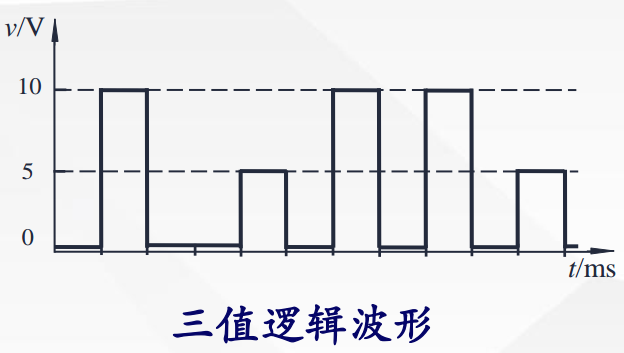
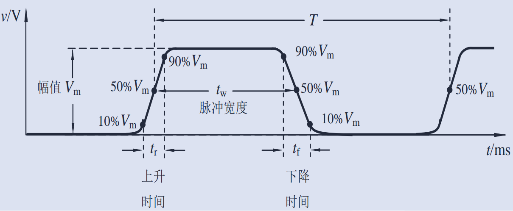
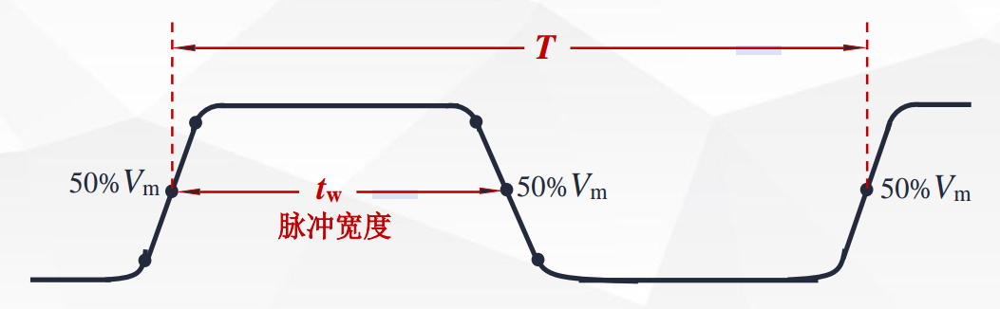

# 数字信号描述方法

[toc]

## 信号分类

- 电信号
  - 模拟电信号：它的电压或电流的幅值随时间连续变化
  
    
  
  - 数字电信号：它的电压或电流在幅值上和时间上都是离散的
  
    

## 数字信号描述方法

### 1. 二值数字逻辑

0、1数码

- 表示数量时称二进制数
- 表示事物状态时称二值逻辑

### 2. 逻辑电平

- 数字信号可以用高、低电平来表示

- 数字电路中，高低电平统称为逻辑电平

  - 低电平：电压值在（$0 \sim V_{L(max)}$）范围内，通常用**0**表示

  - 高电平： 电压值在（$V_{H(min) \sim + V_{DD}}$）范围内，通常用**1**表示

- **电压值在$V_{L(max) \sim V_{H(min)}}$ 范围内则没有定义，不能使用**

- CMOS器件的电压值范围与逻辑电平之间的对应关系:

  | 电压    | 二值逻辑 | 电平      |
  | ------- | -------- | --------- |
  | 3.5V~5V | 1        | H(高电平) |
  | 0~1.5V  | 0        | L(低电平) |

  

### 3. 数字波形

> 是信号逻辑电平对时间的图形表示。

**通常在分析一个数字系统时，由于电路采用相同的逻辑电平标准，一般可以不标出高、低电平的电压值。时间轴也可以不标。**

- **在当今的数字电路中，一般采用具有两个状态的二值数字逻辑。**

## 实际脉冲波形及主要参数

- ### 理想的脉冲信号

  

- ### 非理想脉冲波形

  

- ### 主要参数：

  - 脉冲幅值$V_m$ ——脉冲电压的最大变化幅度，即图中高电平的电
    压值，单位为伏特（V）。

  - 上升时间 $t_r$ —— 指矩形脉冲上升沿从 $10\%V_m$ 上升到 $90\% V_m$ 时所经历的时间 (单位为 ns )。

  - 下降时间 $t_f$ —— 指矩形脉冲下降沿从 $90\% V_m$下降到 $10\% V_m$ 时所经历的时间 (单位为 ns ) 。

  - 周期 $T$ —— 周期性重复的矩形脉冲中，两个相邻脉冲之间的时间间隔。

  - 有时也用频率来表示，即$f = \frac {1}{T} $  ，表示单位时间内重复出现脉冲的次数

  - 脉冲宽度 $t_w$ —— 从脉冲上升沿中间点（  $50\%V_m$ ）起，到脉冲下降沿中间点为止的一段时间。

  - 占空比 $q$ —— 表示脉冲宽度占整个周期的百分比。

    $q(\%) = \frac {t_w}{T} \times 100\%$

    

  
