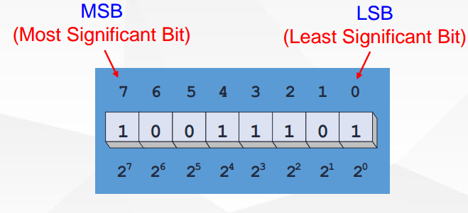
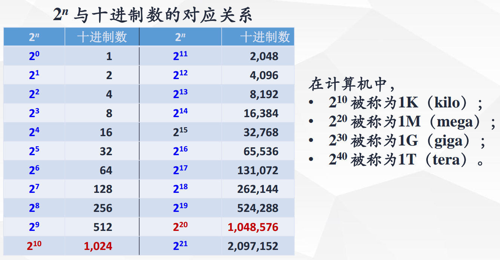
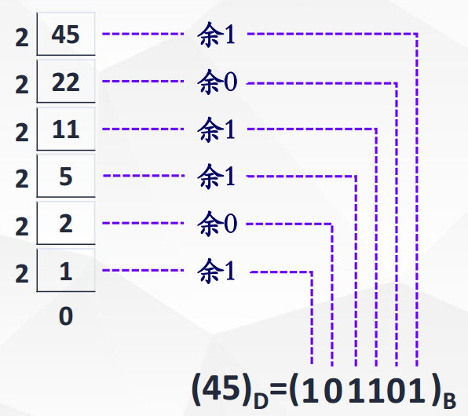
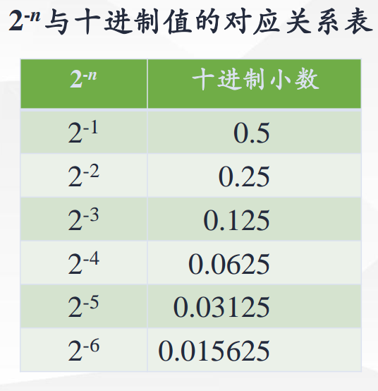
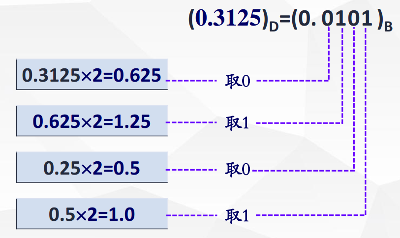

# 数制

[toc]

## 1、数制基础

### 含义

- 即计数规则，通常用一串数字来表示数的大小。

- 我们把多位数码中每一位的构成方法以及从低位向高位的进位规则就称为数制。

#### 十进制

>是以 10 为基数的计数体制。
>采用0、 1、 2、 3、 4、 5、 6、 7、 8、 9十个
>数码，其进位的规则是“逢十进一” 。

一般表达式: $(N)_D = \sum_{i=-\infty}^{\infty} (K_i \times 10^i)$

各位的权都是10的幂。

#### R进制

>是以 R 为基数的计数体制。采用 0 ~ R-1 个数码，其进位的规则是“逢R进一”。

一般表达式: $(N)_R = \sum_{i=-\infty}^{\infty} (K_i \times R^i)$

各位的权都是R 的幂。

#### 二进制

>是以 2 为基数的计数体制；
>采用 0 和 1 两个数码，其进位规则是“逢二
>进一”。

多位二进制数中的每一个数码称为 1 位（或 1 bit），8 位二进制数称为一个字节（Byte） 。

一般表达式: $(N)_B = \sum_{i=-\infty}^{\infty} (K_i \times 2^i)$

各位的权都是2的幂。

#### 八进制

>是以8为基数的计数体制；采用 0, 1, 2, 3, 4, 5, 6, 7 八个数码，其进位的规则是“逢八进一”。

一般表达式: $(N)_O = \sum_{i=-\infty}^{\infty} (K_i \times 8^i)$

各位的权都是8的幂。

#### 十六进制

>是以16为基数的计数体制；采用 0, 1, 2, 3, 4, 5, 6, 7, 8, 9 , A , B , C , D , E , F十六个数码，进位规则是“逢十六进一”。

一般表达式: $(N)_H = \sum_{i=-\infty}^{\infty} (K_i \times 16^i)$

各位的权都是16的幂。

### 各种不同进制数的特点对照表

| 数制 | 基数 | 数码 | 计数规则 | 一般表达式 |
| ---- | ---- | ---- | -------- | ---------- |
|十进制 |10| 0 ~ 9 |逢十进一|$(N)_D = \sum_{i=-\infty}^{\infty} (K_i \times 10^i)$|
|二进制| 2 |0、 1 |逢二进一|$(N)_B = \sum_{i=-\infty}^{\infty} (K_i \times 2^i)$|
|八进制 |8| 0 ~ 7 |逢八进一|$(N)_O = \sum_{i=-\infty}^{\infty} (K_i \times 8^i)$|
|十六进制| 16| 0 ~ 9、 A、 B、C、 D、 E、 F |逢十六进一|$(N)_H = \sum_{i=-\infty}^{\infty} (K_i \times 16^i)$|
|R 进制| R |0 ~（R-1）| 逢 R 进一|$(N)_R = \sum_{i=-\infty}^{\infty} (K_i \times R^i)$|

### 不同进制数的对照表

| 十进制(Decimal) | 二进制(Binary) | 八进制(Octal) | 十六进制(Hexadecimal) |
| --------------- | -------------- | ------------- | --------------------- |
| 0 | 0000 | 0 |0|
| 1 | 0001 | 1 |1|
| 2 | 0010 | 2 |2|
| 3 | 0011 | 3 |3|
| 4 | 0100 | 4 |4|
| 5 | 0101 | 5 |5|
| 6 | 0110 | 6 |6|
| 7 | 0111 | 7 |7|
| 8 | 1000 | 10 |8|
| 9 | 1001 | 11 |9|
| 10 | 1010 | 12 |A|
| 11 | 1011 | 13 |B|
| 12 | 1100 | 14 |C|
| 13 | 1101 | 15 |D|
| 14 | 1110 | 16 |E|
| 15 | 1111 | 17 |F|

## 2、进制转换

### 二—十进制数之间的转换

-  **二进制数转换为十进制的方法**

  >按照“按权展开”公式进行计算。即将每个数码与相应位置上的权相乘，然后再求和。

  - 

  - **例：**将二进制数$(1001\; 1101)_2$转换为十进制数。

    $$\begin{equation}\begin{split}(1001\;1101)_2 &= 1\times2^7 + 0\times2^6 + 0\times2^5 + 1\times2^4 \\&+ 1\times2^3 + 1\times2^2 + 0\times2^1 + 1\times2^0\\&=128+16+8+4+1\\&=(157)_D\end{split}\end{equation}$$
  
  - **例：**将二进制小数$( 0.1011)_2$转换为十进制数。
  
    $$\begin{equation}\begin{split} (0.1011)_2 &= 1\times2^{-1}+0\times2^{-2}+1\times2^{-4}+1\times2^{-4}\\&=0.5+0.125+0.0625\\&=(0.6875)_D \end{split}\end{equation}$$
  
#### 十进制整数的转换

  - 加权求和法

    >所谓加权求和法： 就是确定一组二进制权使它们的和等于已知的十进制数。
    >
    >

    - **例：** 

      $$\begin{split}(9)_D &= 8+1\\&=1\times2^3+0\times2^2+0\times2^1+1\times2^0\\&=(1001)_B \end{split}$$

  - **除2取余法**

    >将十进制整数除以 2，取其余数，所得之商再除以 2，再取其余数，如此重复，直到商为0。每次得到的余数构成转换结果的对应位数码；第1个余数为最低位，最后一个余数为最高位。

    - **例：**将十进制数 45 转换为二进制数。

      

#### 十进制小数的转换

  - 加权求和法

    >所谓加权求和法： 就是确定一组二进制权使它们的和等于已知的十进制数。
    >
    >

    

    - **例：**

      $$\begin{split}( 0.625)_D &=0.5 + 0.125\\&= 2^{-1}+2^{-3}\\&=(0.101)_B \end{split}$$

  - 乘2取整法

    >将十进制小数乘以 2， 取出整数，剩余的小数再乘以 2， 再取出整数， 如此重复，直到小数部分为0或小数部分的位数满足误差要求，进行“四舍五入”为止。每次得到的整数构成转换结果的对应位数码。

    - **例：**将十进制小数 $(0.3125)_D$转换为二进制数。

      

    - ==**注意：**一般情况下题目要求转换误差小于1%，只需要转换到小数点后面的第7位。==